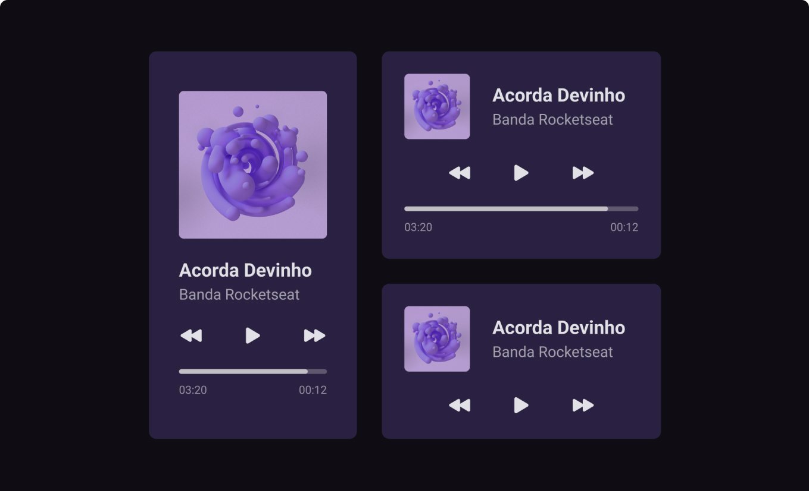

# Music Player

Desafio `01` do [#boraCodar](https://boracodar.dev/) um player de música.
Você pode acessar o layout no figma [clicando aqui](https://www.figma.com/community/file/1195050524500542670)

## Preview

  

  <h1><a href="https://pduartesilva2005.github.io/bora-codar-music-player">👾 Site ao vivo</a></h1>

## Construído com

- Marcação HTML5 semântica
- Propriedades personalizadas de CSS
- Interações com JavaScript

## Desafios

- [x] Criar um player de musica baseado no layout
- [x] Responsivo
- [x] Deixar o Player Funcional

## Melhorias Futuras

- [ ] Ter uma playlist de musicas

## Autor

[@pduartesilva2005](https://www.linkedin.com/in/pduartesilva2005/)
